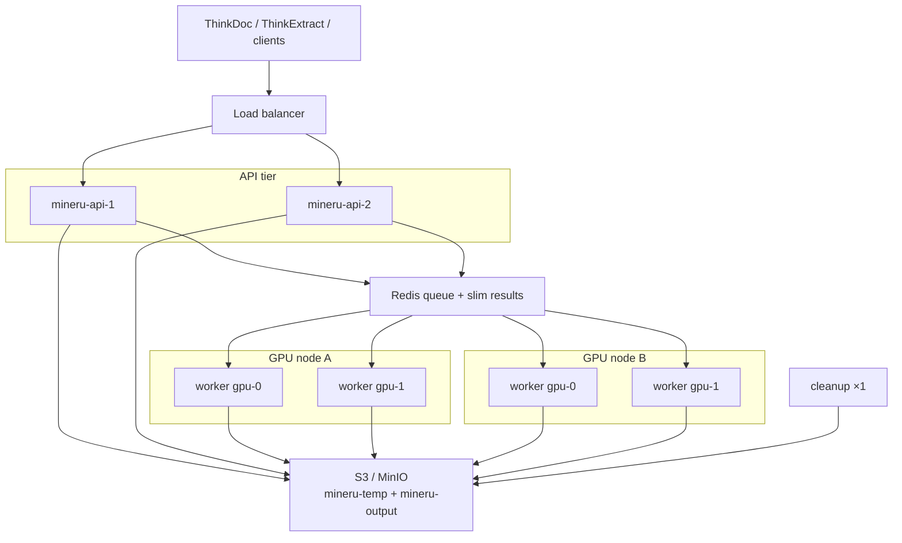

# Large-Scale Production: Multi-Node Multi-Worker

Deployment guide for ThinkParse / MinerU API across multiple servers and GPU workers.  
Single-host setup: [DEPLOYMENT.md](DEPLOYMENT.md). Multi-GPU workers: `cd docker && sh gpu-up.sh`.

## 1. Recommended architecture

Do **not** share local `TEMP_DIR` / `OUTPUT_DIR` across machines. Use shared object storage and Redis:

| Component | Placement | Role |
|-----------|-----------|------|
| **S3 / MinIO** | Dedicated / managed | Shared uploads and parse outputs |
| **Redis** | Dedicated / managed | Celery broker + slim task metadata (bodies not in Redis) |
| **API** | ≥1 hosts, horizontally scalable | Submit + status only |
| **GPU workers** | 1–N containers per GPU host | `MINERU_WORKERS_PER_GPU` engines per card; same queue |
| **Cleanup** | Exactly one instance | Output cleanup (temp via S3 lifecycle) |



## 2. Sizing starters

| Role | Starting point | Count |
|------|----------------|-------|
| Redis | 4–8 vCPU, 8–16GB, dedicated SSD, AOF `everysec` | 1 (or managed / Sentinel) |
| S3 | Capacity + temp lifecycle | Same AZ as workers |
| API | 4 vCPU, 8GB, no GPU | 2+ for HA |
| GPU nodes | 1–8 GPUs each | Scale out for throughput |
| Cleanup | Small VM or with API | **One** globally |

Keep `GPU_WORKER_CONCURRENCY=1` (one process does not parse in parallel). Scale by adding GPU hosts or raising `MINERU_WORKERS_PER_GPU`, then re-run `sh gpu-up.sh`. Lower the per-card process count if VRAM is tight.

## 3. Shared config (all nodes)

```bash
MINERU_STORAGE_TYPE=s3
MINERU_S3_ENDPOINT=https://s3.example.com
MINERU_S3_ACCESS_KEY=...
MINERU_S3_SECRET_KEY=...
MINERU_S3_BUCKET_TEMP=mineru-temp
MINERU_S3_BUCKET_OUTPUT=mineru-output
MINERU_S3_SECURE=true

REDIS_URL=redis://:STRONG_PASSWORD@redis.internal:6379/0

MINERU_QUEUE=mineru-tasks
MINERU_EXCHANGE=mineru
MINERU_ROUTING_KEY=mineru.tasks

RESULT_EXPIRES=3600
WORKER_POOL=threads
ENVIRONMENT=production
CORS_ALLOWED_ORIGINS=https://app.example.com
```

Configure S3 temp bucket lifecycle ([S3_LIFECYCLE_SETUP.md](S3_LIFECYCLE_SETUP.md)).

## 4. Per-role startup

### Redis host

```bash
REDIS_DATA_PATH=/data/redis
COMPOSE_PROFILES=redis
cd docker && docker compose up -d redis
```

### API hosts (no GPU)

```bash
cd docker && docker compose up -d mineru-api
# Run mineru-cleanup on exactly one host only
```

Put an LB in front of API replicas.

### GPU worker hosts

Dedicated GPU hosts must **not** run bare `docker compose up -d`: `mineru-api` / `mineru-cleanup` have no profile and would start too (duplicate APIs / cleanup).

Use `gpu-up.sh` with the worker-only overlay (**do not** enable `mineru-gpu`):

```bash
# docker/.env
MINERU_GPU_COUNT=2
MINERU_WORKERS_PER_GPU=4
GPU_WORKER_CONCURRENCY=1
MINERU_GPU_WORKER_ONLY=1
```

```bash
# project .env — shared Redis/S3 (not hostname "redis" unless that service is local)
REDIS_URL=redis://:STRONG_PASSWORD@redis.internal:6379/0
MINERU_STORAGE_TYPE=s3
WORKER_POOL=threads
```

```bash
cd docker && sh gpu-up.sh
docker compose -f docker-compose.yml -f docker-compose.gpus.yml \
  -f docker-compose.worker-only.yml --profile mineru-multi-gpu ps
docker exec mineru-worker-gpu-0-0 nvidia-smi -L
```

Same queue / Redis / S3 on every GPU host. Workers compete for tasks automatically.

For **single-host** Redis+API+multi-GPU, leave `MINERU_GPU_WORKER_ONLY` unset and run `sh gpu-up.sh`. The older `docker-compose.multi-gpu.yml` profiles `mineru-gpu-0,mineru-gpu-1` still work, but do not run them beside the generated workers.

## 5. Ops notes

- Use `/api/v1/tasks/submit` + status polling — not `/file_parse` (local-path, not S3-safe).  
- Scale throughput by adding GPU hosts or raising `MINERU_WORKERS_PER_GPU`, then re-run `sh gpu-up.sh`.  
- Keep Redis on its own disk; bodies live in S3 after the slim-result change.  
- Checklist: shared S3 + Redis + queue names; one cleanup; `GPU_WORKER_CONCURRENCY=1`; LB for API HA.

See also: [S3_STORAGE.md](S3_STORAGE.md), [CLEANUP_CONTAINER.md](CLEANUP_CONTAINER.md), [DEPLOYMENT.md](DEPLOYMENT.md).
