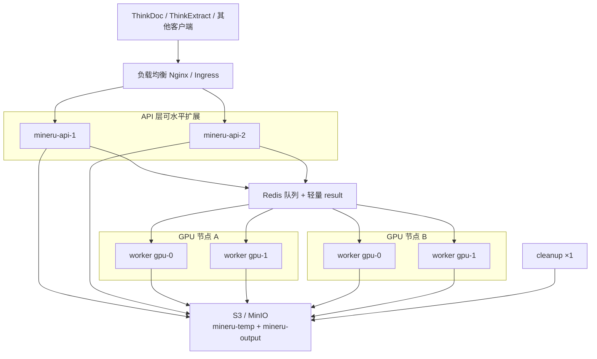

# 大规模生产部署：多机多 Worker

面向多台服务器、多 GPU Worker 的 ThinkParse / MinerU API 部署方案。  
单机起步见 [DEPLOYMENT.zh.md](DEPLOYMENT.zh.md)。多卡 Worker：`cd docker && sh gpu-up.sh`。

## 1. 推荐架构

多机场景下，**不要**用本地 `TEMP_DIR`/`OUTPUT_DIR` 共享（各机磁盘不互通）。统一使用：

| 组件 | 部署方式 | 说明 |
|------|----------|------|
| **对象存储 S3/MinIO** | 独立集群或托管 | 上传与解析结果的唯一共享介质 |
| **Redis** | 独立节点 / 云 Redis | Celery 队列 + 轻量任务元数据（正文不进 Redis） |
| **API** | ≥1 台，可水平扩展 | 只负责提交任务、查询状态；无状态（状态在 Redis，正文在 S3） |
| **GPU Worker** | 每台 GPU 机器 1～N 个容器 | 每卡 `MINERU_WORKERS_PER_GPU` 个引擎；订阅同一队列 |
| **Cleanup** | 1 个即可 | 主要清 output（temp 靠 S3 lifecycle） |



流程简述：

1. 客户端 `POST /api/v1/tasks/submit` → API 把文件写入 **S3 temp**，往 Redis 丢任务  
2. 任意空闲 Worker 领取任务 → 从 S3 下载 → 本地 GPU 解析 → 结果写入 **S3 output** → Redis 只留 key/元数据  
3. 客户端 `GET /api/v1/tasks/{id}` → API 从 Redis 读状态，从 S3 **拼装** markdown / images / content_list  

## 2. 节点角色与规模建议

| 角色 | 建议规格起点 | 数量建议 |
|------|----------------|----------|
| Redis | 4～8 vCPU、8～16GB、**独立 SSD**、AOF `everysec` | 1 主（生产可加 Sentinel/托管） |
| S3/MinIO | 大容量磁盘或对象存储；temp lifecycle | 与业务对象存储同可用区 |
| API | 4 vCPU、8GB；无 GPU | 2+（HA） |
| GPU Worker 节点 | 每节点 1～8 GPU | 按吞吐扩 |
| Cleanup | 与 API 同机或单独小机 | 全局 **1** 个 |

吞吐粗算（因模型与页数差异大，仅作起点）：

- 每个进程保持 `GPU_WORKER_CONCURRENCY=1`（一个进程不会并行解析）  
- 扩容优先 **加 GPU 节点**，或提高 `MINERU_WORKERS_PER_GPU` 后再跑 `sh gpu-up.sh`；显存紧张时减少每卡进程数  

## 3. 配置原则（所有节点共用）

项目根目录 `.env`（或各机等价配置）核心项保持一致：

```bash
# ---- 共享 ----
MINERU_STORAGE_TYPE=s3
MINERU_S3_ENDPOINT=https://s3.example.com
MINERU_S3_ACCESS_KEY=...
MINERU_S3_SECRET_KEY=...
MINERU_S3_BUCKET_TEMP=mineru-temp
MINERU_S3_BUCKET_OUTPUT=mineru-output
MINERU_S3_SECURE=true

# 所有 API / Worker 指向同一 Redis（密码、库号一致）
REDIS_URL=redis://:STRONG_PASSWORD@redis.internal:6379/0

MINERU_QUEUE=mineru-tasks
MINERU_EXCHANGE=mineru
MINERU_ROUTING_KEY=mineru.tasks

RESULT_EXPIRES=3600
WORKER_POOL=threads
ENVIRONMENT=production
CORS_ALLOWED_ORIGINS=https://app.example.com
```

并配置 S3 **temp bucket lifecycle**（多为按天；见 [S3_LIFECYCLE_SETUP.zh.md](S3_LIFECYCLE_SETUP.zh.md)）。

## 4. 分角色 Compose 启动

以下均在各机 `docker/` 目录操作。生产一般 **不** 在 Worker 节点起内置 Redis profile。

### 4.1 Redis 节点（示例）

可用托管 Redis，或单独 compose 只跑 Redis，并设置：

```bash
# docker/.env
REDIS_DATA_PATH=/data/redis          # 独立盘，勿与其它大文件混用
REDIS_PORT=6379
COMPOSE_PROFILES=redis
```

```bash
cd docker && docker compose up -d redis
# 生产务必配 requirepass，客户端 REDIS_URL 带密码
```

### 4.2 API 节点（无 GPU）

```bash
# docker/.env — 不要开 mineru-gpu / mineru-cpu
COMPOSE_PROFILES=
# 或不写 worker profiles，只起 api + cleanup（其一即可跑 cleanup）

# 项目 .env
REDIS_URL=redis://:STRONG_PASSWORD@redis.internal:6379/0
MINERU_STORAGE_TYPE=s3
# ... S3 同上
```

```bash
cd docker && docker compose up -d mineru-api mineru-cleanup
# 第二台 API：只起 mineru-api，不要再起第二个 cleanup
```

多台 API 前加 Nginx / Ingress；`proxy_read_timeout` 对同步接口可加长，异步 submit/status 默认即可。

### 4.3 GPU Worker 节点

专用 GPU 机不要用「裸」`docker compose up -d`：`mineru-api` / `mineru-cleanup` **没有 profile，会默认一起起来**，造成多余 API 与重复 cleanup。

用 `gpu-up.sh` 加上 worker-only（**不要**开 `mineru-gpu`）：

```bash
# docker/.env
MINERU_GPU_COUNT=2
MINERU_WORKERS_PER_GPU=4
GPU_WORKER_CONCURRENCY=1
MINERU_GPU_WORKER_ONLY=1
```

```bash
# 项目 .env（所有 GPU 节点一致）
REDIS_URL=redis://:STRONG_PASSWORD@redis.internal:6379/0
# 切勿再写成 redis://redis:6379/0 —— 本机没有名为 redis 的容器时会连不上
MINERU_STORAGE_TYPE=s3
WORKER_POOL=threads
```

```bash
cd docker && sh gpu-up.sh
# 此时应只有 mineru-worker-gpu-* ，没有 api/cleanup
docker compose -f docker-compose.yml -f docker-compose.gpus.yml \
  -f docker-compose.worker-only.yml --profile mineru-multi-gpu ps
```

第二台 GPU 机器同样用 `sh gpu-up.sh`，按本机卡数填写 `MINERU_GPU_COUNT`；**队列名与 Redis/S3 必须相同**。

单机同时跑 Redis+API+多卡 Worker 时：不要设 `MINERU_GPU_WORKER_ONLY`，直接 `sh gpu-up.sh`。旧文件 `docker-compose.multi-gpu.yml` 的 `mineru-gpu-0,mineru-gpu-1` 仍可用，但不要和生成的 Worker 一起跑。

验证：

```bash
docker exec mineru-worker-gpu-0-0 nvidia-smi -L   # 应只有一张可见卡，容器内显示为 GPU 0
curl http://api.internal:8000/api/v1/queue/stats
```

## 5. 网络与安全

- API、Worker、Redis、S3 尽量同 VPC / 内网；S3 用内网 endpoint  
- Redis **仅内网** + 强密码；生产关闭无鉴权  
- API 前 HTTPS 终止；限制 `CORS_ALLOWED_ORIGINS`  
- 生产客户端只用 `POST /api/v1/tasks/submit` + 轮询 status，**不要**用本机路径的 `/file_parse`（与 S3 分布式不兼容）  

## 6. 扩容与运维

| 动作 | 做法 |
|------|------|
| 提高吞吐 | 加 GPU 节点，或提高 `MINERU_WORKERS_PER_GPU` 后重新 `sh gpu-up.sh` |
| API 高峰 | 加 API 副本 + LB |
| Redis 压力 | 已实现「结果瘦身」；仍紧则升配内存、缩短 `RESULT_EXPIRES` |
| 磁盘打满 | 文件在 S3；仍要保证 Redis 独立盘、lifecycle、cleanup 在跑 |
| 发布升级 | 先滚动 Worker（可短时降吞吐），再滚动 API；共享 `.env`/镜像标签一致 |

故障排查短清单：

1. Worker 能否 `PING` Redis、访问 S3 endpoint  
2. `queue/stats` 是否堆积、worker 是否 registered  
3. 完成态 status 是否能从 S3 hydrate 出 markdown/images  
4. temp lifecycle / cleanup 是否生效  

## 7. 上线检查清单

- [ ] 专用 GPU 节点使用 `docker-compose.worker-only.yml`，确认未启动本机 api/cleanup  
- [ ] `REDIS_URL` 指向可达地址（多机勿使用仅本机 compose 网络内的 `redis` 主机名）  
- [ ] 全部节点 `MINERU_STORAGE_TYPE=s3`，bucket 可读写  
- [ ] temp bucket 已配 lifecycle  
- [ ] 全部节点同一 `REDIS_URL` / 同一 `MINERU_QUEUE`  
- [ ] Redis 独立磁盘 + 密码；AOF 与文件存储分盘  
- [ ] GPU：`sh gpu-up.sh`，`GPU_WORKER_CONCURRENCY=1`，按显存设置 `MINERU_WORKERS_PER_GPU`  
- [ ] 全局仅 **一个** cleanup  
- [ ] API ≥2 + LB（需要 HA 时）  
- [ ] 不用 `/file_parse` 做分布式生产流量  
- [ ] ThinkDoc / ThinkExtract 的 MinerU 基址指向 LB  

## 8. 与单机方案对比

| | 单机 compose | 本方案（多机） |
|--|--------------|----------------|
| 存储 | local volume 或 S3 | **必须 S3** |
| Redis | compose 内置 + `REDIS_DATA_PATH` | **独立/托管** |
| Worker | 本机 GPU | 多机多卡，同队列 |
| API | 通常 1 | 可多副本 |

更细的 S3 / 清理 / Redis 分盘说明见：

- [S3_STORAGE.zh.md](S3_STORAGE.zh.md)  
- [CLEANUP_CONTAINER.zh.md](CLEANUP_CONTAINER.zh.md)  
- [DEPLOYMENT.zh.md](DEPLOYMENT.zh.md)  
